# HW3
Домашняя Работа
1.
№4

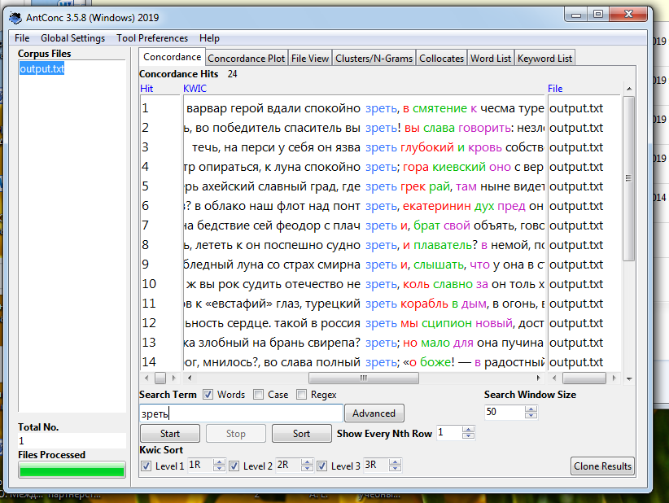
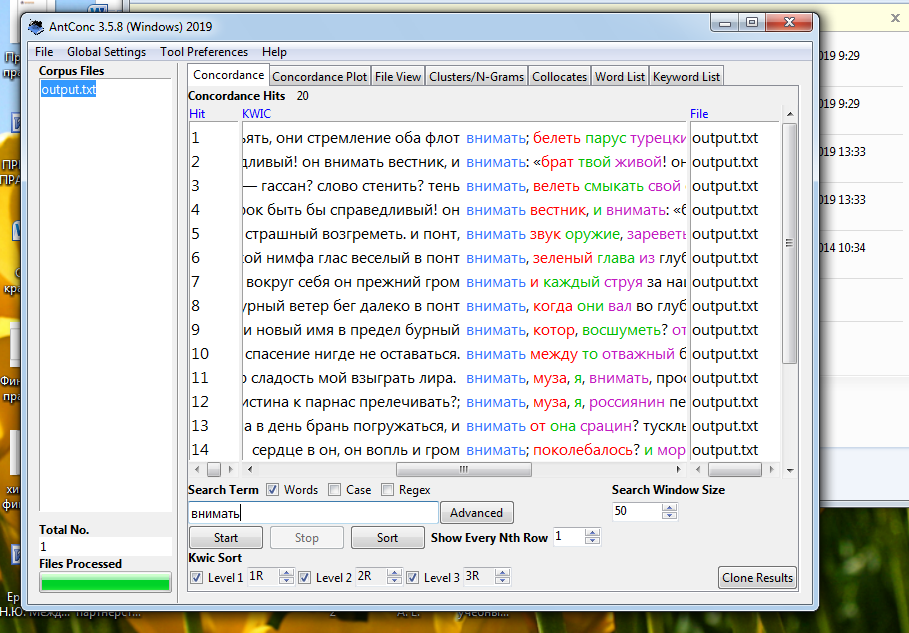
№5
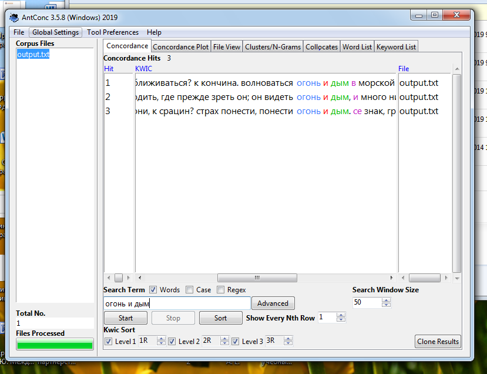
№6
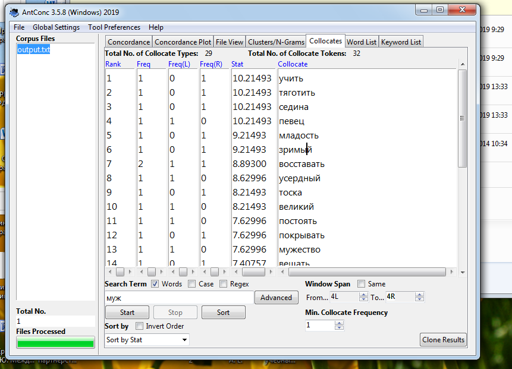
2.
№2
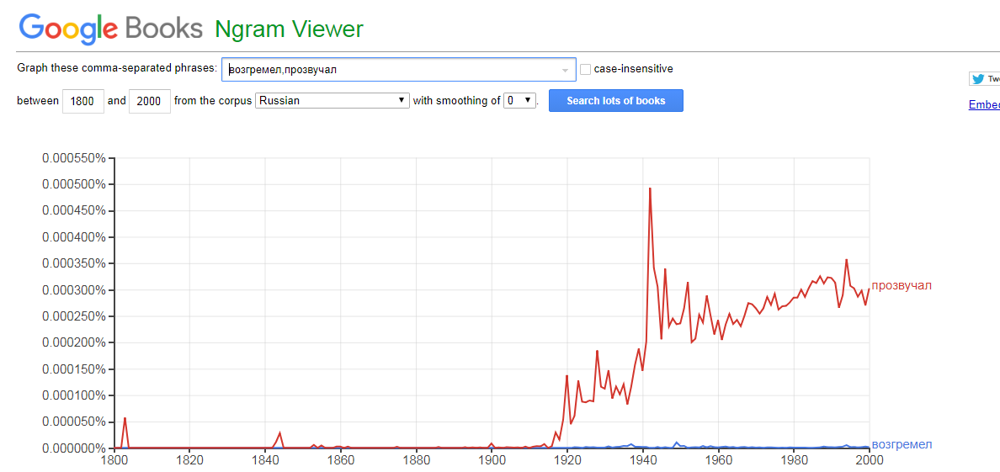
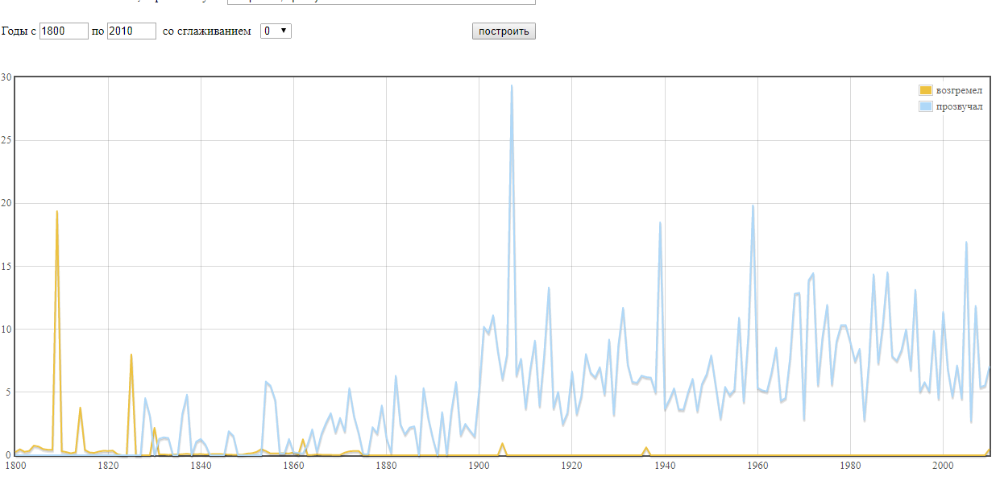
На первом графике мы видим, что с 1800 по 2000 г. слова "возгремел" и "прозвучал" почти не употреблялись, а c 1920 слово "прозвучал" стало употребляться чаще. На втором графике мы видим, что слово "возгремел" в 1800 г. было популярнее чем "прозвучал", но и как на первом графике с 1920 г. " прозвучал" стало употребляться чаще.

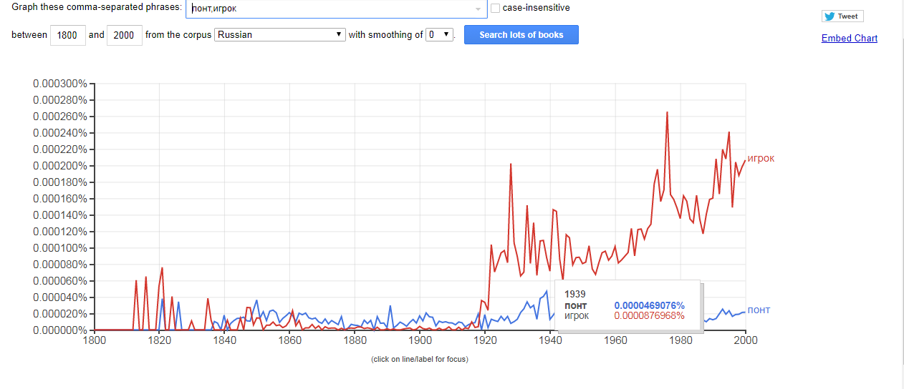
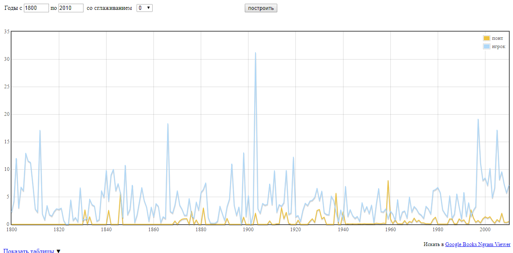
На этих двух графиках мы видим, что слово "игрок" с 1800 г. всегда употрелялось чаще чем "понт"

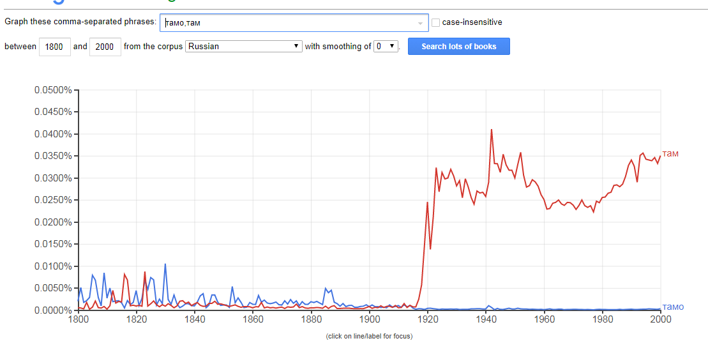
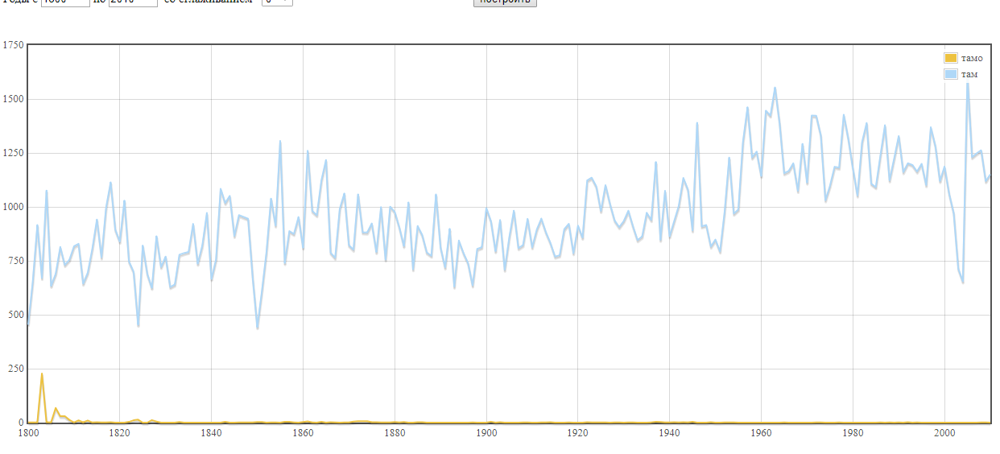
На первом графике мы видим, что "там" и "тамо" употрблялись с одинаковой чстотностью, а в 1920 "там" стало употреблять чаще. На втором графике показано, что " там" всегда употреблялось чаще.

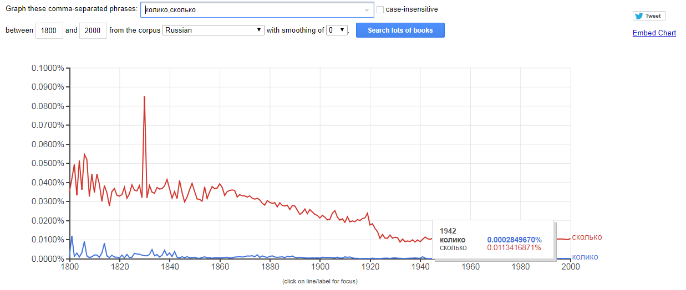
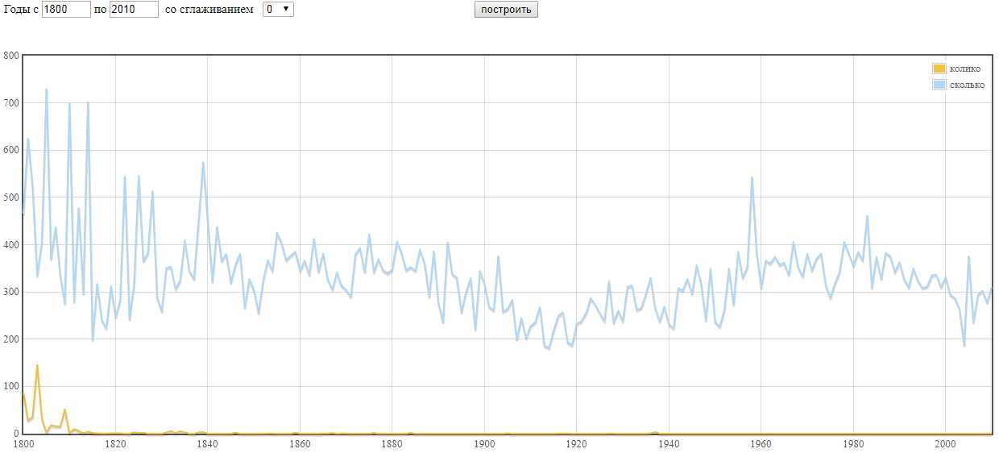
На этих двух графиках показано, что слово "сколько" всегда употреблялось чаще слова "колико"
IPM возгремел-0,056
IPM прозвучал-6,174
IPM понт-0,67
IPM игрок- 5,006
IPM тамо- 3,108
IPM там- 1013,17
IPM колико-1,771
IPM сколько- 311, 513

№3
 Данный навык работы может пригодиться при подсчете употребления   слова в тексте, сравнения частоты употребления слов и.т.д. В целом это полезный навык, которому стоит обучиться всем филологам. AntConc, googlngrams и НКРЯ могут упростить исследовния каких-либо текстов. 
